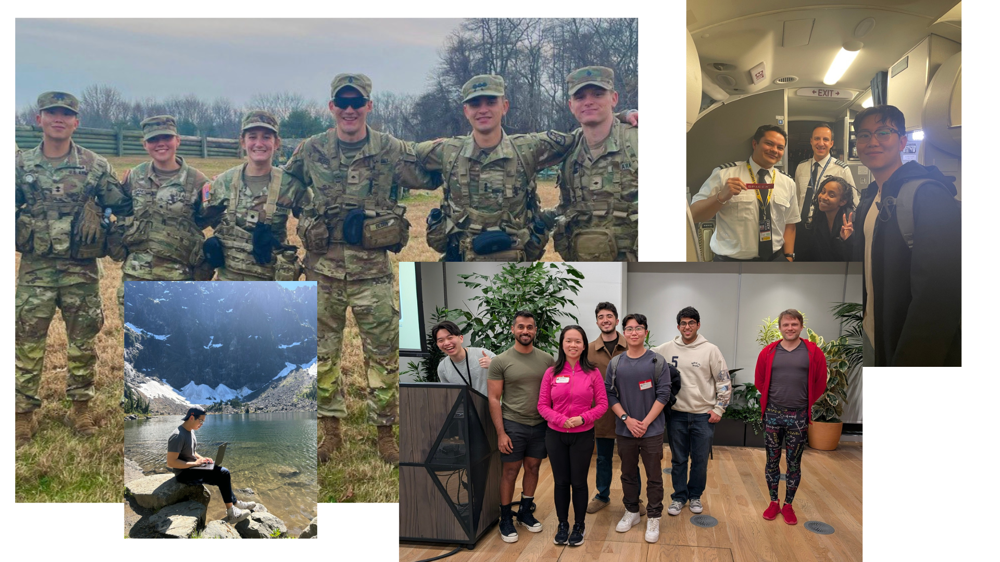

<h2 align="left">Hi, I'm Brian!</h2>

###

I'm studying computer science at Princeton, with a focus on machine learning.   I was most recently at SpaceX, where I wrote Starlink's wifi telemetry system. I also designed Starlink's Enterprise & Government interface, and was one of the first software engineers on Starlink's Aviation team. If you've flown recently (on certain airlines), you've probably used a bit of my code! 
  
My current research explores AI alignment in public sector applications, advised by Prof. Arvind Narayanan and funded by Anthropic. I previously researched computer vision for 2D quantum materials, advised by Prof. Olga Russakovsky.

I love hiking, lifting, new foods, and cooking. My best lift total is 1005 lbs, and I help run a pop-up restaurant on campus. At Princeton, I also led our region's Army ROTC battalion and graduated Air Assault School. 

  

